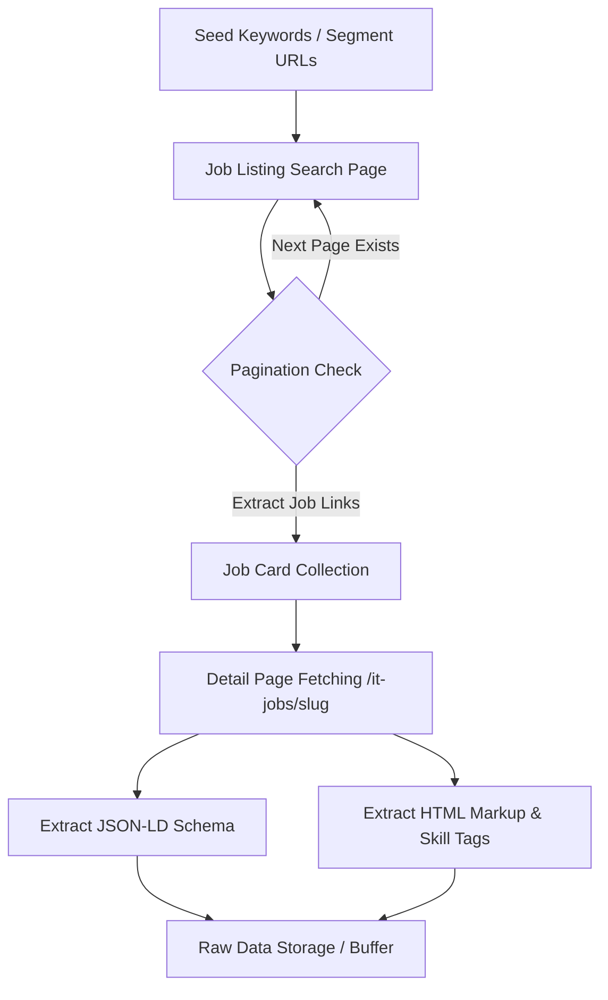

# Source Inspection & Technical Feasibility Report: ITviec (VN Tech Job Board)

## 1. Target Source Overview & Feasibility Verdict

* **Target Source**: [ITviec](https://itviec.com) (Viet Nam Tech Job Platform)
* **Domain Focus**: Information Technology, Data Engineering, Data Analytics, Artificial Intelligence, Machine Learning, Business Intelligence, and Software Engineering in Vietnam.
* **Target URLs**:
  * Listing Seed URLs: 
    * `https://itviec.com/it-jobs/data-analyst`
    * `https://itviec.com/it-jobs/data-engineer`
    * `https://itviec.com/it-jobs/ai-machine-learning-engineer`
    * `https://itviec.com/it-jobs/business-analyst`
    * Segment URL: `https://itviec.com/segments/viec-lam-ai-data`
  * Detail Page URL Pattern: `https://itviec.com/it-jobs/<job-slug>`
* **Feasibility Verdict**: **HIGHLY VIABLE (APPROVED)**

### Key Rationale for Feasibility
1. **Server-Side Rendered (SSR) HTML**: ITviec renders initial page responses server-side (Ruby on Rails), allowing traditional HTTP GET requests to retrieve complete job detail markup without requiring heavy JS rendering for raw text extraction.
2. **Embedded JSON-LD Structured Data**: ITviec embeds standard `<script type="application/ld+json">` (`Schema.org/JobPosting`) blocks directly in detail pages, providing structured fields (`title`, `datePosted`, `hiringOrganization`, `jobLocation`, `skills`, `description`) out-of-the-box.
3. **High Signal-to-Noise Ratio**: Unlike multi-industry Vietnamese job sites (e.g., VietnamWorks, TopCV, CareerBuilder), ITviec is exclusively tailored to tech roles. Data and AI job postings feature detailed technical skill requirements (SQL, Python, Spark, AWS, Tableau, PyTorch, etc.).

---

## 2. Page Structure & Navigation Workflow

### 2.1 Listing Page Structure (`/it-jobs/<keyword>` or `/it-jobs?query=<term>`)
* **Header Summary**: Contains total match count (e.g., `<h1 class="headline-total-jobs">13 data analyst jobs in Vietnam</h1>`).
* **Filters**: Level (`Internship`, `Fresher`, `Junior`, `Senior`, `Manager`), Working Model (`Onsite`, `Remote`, `Hybrid`), Job Domain, Salary range sliders.
* **Job Listing Container**: Element container with `.card-jobs-list`.
* **Job Card Items**: Each job item `.job-card` holds structured data attributes:
  * `data-job-key`: Unique UUID identifier (e.g., `292b4915-50d6-40fe-a2f0-ea69f6b428d6`).
  * `data-search--job-selection-job-slug-value`: URL slug identifier.
  * Links: `href="https://itviec.com/it-jobs/<job-slug>"` leading to standalone job detail pages.

### 2.2 Pagination Workflow
* Listing pages display up to 20 job cards per page.
* Pagination navigation operates via page query parameters (e.g., `?page=2`) or Turbo/AJAX partial page updates.
* Crawling can iterate linearly over page numbers until no further `.job-card` elements are retrieved or total job count matches collected records.

### 2.3 Detail Page Structure (`/it-jobs/<job-slug>`)
* **Metadata Header**: Job title (`<h1>` or `<h3>`), employer logo, company name, location badges, posted time, working model.
* **Skill Tags**: Container `.responsive-tag-list` containing explicit skill pill tags (`Data Analysis`, `SQL`, `Power BI`, `Tableau`, `Python`).
* **Job Description Sections**: Standardized sections covering:
  * *Top Reasons To Join Us*
  * *Job Description / Key Responsibilities*
  * *Your Skills and Experience / Requirements*
  * *Why You'll Love Working Here / Benefits*
* **JSON-LD Script Tag**: `<script type="application/ld+json">` containing schema metadata.

---

## 3. Extractable Fields vs. Missing / Gated Fields (Mapped to Data Schema v1)

| Standard Schema Field | Field Extractability Status | Primary Source Location on ITviec | Technical Notes / Fallbacks |
| :--- | :--- | :--- | :--- |
| **`job_id`** | **Derived (Internal PK)** | Deterministic Hash (`SHA256(source_url)`) | Unique, immutable identifier independent of line numbers. |
| **`source`** | **Static Constant** | Metadata (`"ITviec"`) | Provenance tracking for multi-source expansion. |
| **`source_job_id`** | **Fully Extractable** | HTML `[data-job-key]` / JSON-LD | Original job key assigned by ITviec platform. |
| **`source_url`** | **Fully Extractable** | Job detail canonical URL | Normalized absolute link to the job posting. |
| **`crawl_timestamp`**| **Runtime Metadata** | ISO 8601 with UTC timezone | Exact execution timestamp of the HTTP request. |
| **`parser_version`** | **Internal Constant**| Parser release tag (e.g., `"v0.1"`) | Versioning control for parser changes. |
| **`raw_job_title`**  | **Fully Extractable** | `JSON-LD.title` / HTML `<h3><a>` / `<h1>` | High quality; preserved exactly as written without alterations. |
| **`company`**        | **Fully Extractable** | `JSON-LD.hiringOrganization.name` / HTML `.logo-employer-card + span a` | Clean company brand name. |
| **`raw_location`**   | **Fully Extractable** | `JSON-LD.jobLocation.address.addressLocality` / HTML location badge | City/Province level (`Ha Noi`, `Ho Chi Minh`, etc.). |
| **`posted_date`**    | **Fully Extractable** | `JSON-LD.datePosted` / HTML posted timestamp | Formatted as ISO `YYYY-MM-DD`. |
| **`raw_experience`** | **Semi-Structured**   | HTML level badges / metadata tags | Preserved raw string (e.g., "3+ years", "Senior"). |
| **`job_description`**| **Fully Extractable** | `JSON-LD.description` / HTML "Job Description" section | Detailed responsibilities, duties, and project context. |
| **`job_requirements`**| **Fully Extractable**| HTML "Your Skills and Experience" section | Primary target text section for skill extraction. |
| **`salary_raw`**     | **Partially Gated**   | HTML `.salary` container / Prose text | Often masked as `"Sign in to view salary"`. Recorded as-is. |
---

## 4. Technical Challenges & Mitigation Strategies

### 4.1 Cloudflare Turnstile & Anti-Bot Protection
* **Observation**: ITviec utilizes Cloudflare CDN, New Relic browser tracking, and Cloudflare Turnstile JS scripts on certain user flows.
* **Mitigation**:
  * Set realistic browser request headers (`User-Agent`, `Accept-Language`, `Referer`, `sec-ch-ua`).
  * Use session throttling and reasonable delay intervals (1.5 to 3.0 seconds between detail page requests).
  * Fallback to browser automation tools (e.g., Playwright / Selenium with stealth plugins) or Cloudflare bypass libraries if basic HTTP client encounters HTTP 403/503 challenges.

### 4.2 Dynamic UI Rendering (Hotwire / Turbo Rails)
* **Observation**: The listing page uses Turbo JS to dynamically swap job detail previews on desktop split-screen views.
* **Mitigation**: Crawl standalone direct URLs (`https://itviec.com/it-jobs/<slug>`) rather than relying on listing preview modals. Standalone URLs return deterministic, static SSR HTML.

### 4.3 Selector Instability Across Frontend Iterations
* **Observation**: Functional CSS class names (e.g., utility classes like `ipt-2`, `ims-2`, `text-rich-grey`) are subject to change during UI redesigns.
* **Mitigation**:
  * Use `<script type="application/ld+json">` parsing as the primary extraction layer.
  * For HTML DOM parsing, use stable data attributes (e.g., `[data-job-key]`, `[data-controller]`) and semantic tags (`h1`, `h3`, `ul`, `li`) rather than purely visual utility classes.

### 4.4 Gated Salary Information
* **Observation**: Exact salary figures are hidden behind authentication for a significant portion of postings.
* **Mitigation**: Treat `salary` as nullable in raw collection. Use regex extractors on `description` prose text to capture disclosed salary ranges when available.

---

## 5. Conclusion & Project Viability

ITviec is an **ideal data source** for our Capstone project on *Occupational Skill Structure Mining in Data & AI*:

1. **Relevance**: 100% of jobs listed are technology roles, ensuring dense coverage of Data Analysts, Data Engineers, Data Scientists, BI Developers, and Machine Learning Engineers in the Vietnamese tech market.
2. **Richness**: Postings contain high-quality skill details, both as standardized skill tags and detailed requirement paragraphs.
3. **Parsing Efficiency**: The presence of embedded JSON-LD structured data dramatically streamlines the data extraction pipeline and protects against minor web design changes.

**Recommendation**: Proceed with developing the initial data scraper module targeting ITviec as our primary Data/AI job sample source.
