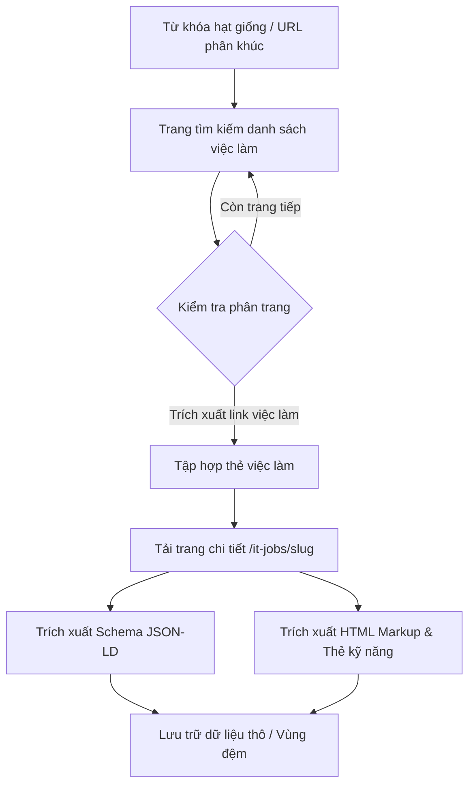

# Báo cáo Khảo sát Nguồn & Tính khả thi Kỹ thuật: ITviec (Nền tảng Việc làm Công nghệ Việt Nam)

## 1. Tổng quan nguồn mục tiêu & Đánh giá tính khả thi

* **Nguồn mục tiêu**: [ITviec](https://itviec.com) (Nền tảng việc làm CNTT Việt Nam)
* **Lĩnh vực trọng tâm**: Công nghệ thông tin, Kỹ nghệ dữ liệu, Phân tích dữ liệu, Trí tuệ nhân tạo, Học máy, Kinh doanh thông minh (BI) và Kỹ nghệ phần mềm tại Việt Nam.
* **Các URL mục tiêu**:
  * Các URL hạt giống (Seed URLs): 
    * `https://itviec.com/it-jobs/data-analyst`
    * `https://itviec.com/it-jobs/data-engineer`
    * `https://itviec.com/it-jobs/ai-machine-learning-engineer`
    * `https://itviec.com/it-jobs/business-analyst`
    * URL phân khúc chuyên môn: `https://itviec.com/segments/viec-lam-ai-data`
  * Mẫu URL trang chi tiết: `https://itviec.com/it-jobs/<job-slug>`
* **Đánh giá tính khả thi**: **KHẢ THI CAO (ĐÃ PHÊ DUYỆT)**

### Các lý do chính chứng minh tính khả thi
1. **HTML kết xuất phía máy chủ (Server-Side Rendered - SSR)**: ITviec kết xuất phản hồi trang ban đầu từ phía máy chủ (Ruby on Rails), cho phép các yêu cầu HTTP GET truyền thống lấy được toàn bộ nội dung HTML chi tiết của việc làm mà không đòi hỏi thực thi JavaScript nặng để bóc tách văn bản thô.
2. **Dữ liệu có cấu trúc nhúng JSON-LD**: ITviec nhúng sẵn các khối `<script type="application/ld+json">` chuẩn (`Schema.org/JobPosting`) trực tiếp trong các trang chi tiết, cung cấp sẵn các trường dữ liệu có cấu trúc (`title`, `datePosted`, `hiringOrganization`, `jobLocation`, `skills`, `description`).
3. **Tỷ lệ tín hiệu trên nhiễu cao (High Signal-to-Noise Ratio)**: Khác với các trang việc làm đa ngành tổng hợp tại Việt Nam (như VietnamWorks, TopCV, CareerBuilder), ITviec chỉ tập trung riêng cho các vai trò công nghệ. Các tin tuyển dụng Data và AI thể hiện yêu cầu kỹ năng kỹ thuật rất chi tiết (SQL, Python, Spark, AWS, Tableau, PyTorch, v.v.).

---

## 2. Cấu trúc trang & Quy trình điều hướng

```mermaid
flowchart TD
    A[Từ khóa hạt giống / URL phân khúc] --> B[Trang tìm kiếm danh sách việc làm]
    B --> C{Kiểm tra phân trang}
    C -->|Còn trang tiếp| B
    C -->|Trích xuất link việc làm| D[Tập hợp thẻ việc làm]
    D --> E[Tải trang chi tiết /it-jobs/slug]
    E --> F[Trích xuất Schema JSON-LD]
    E --> G[Trích xuất HTML Markup & Thẻ kỹ năng]
    F --> H[Lưu trữ dữ liệu thô / Vùng đệm]
    G --> H
```

### 2.1 Cấu trúc trang danh sách (`/it-jobs/<keyword>` hoặc `/it-jobs?query=<term>`)
* **Tiêu đề tóm tắt**: Chứa tổng số lượng khớp (ví dụ: `<h1 class="headline-total-jobs">13 data analyst jobs in Vietnam</h1>`).
* **Bộ lọc**: Cấp bậc (`Internship`, `Fresher`, `Junior`, `Senior`, `Manager`), Hình thức làm việc (`Onsite`, `Remote`, `Hybrid`), Lĩnh vực, Thanh trượt khoảng lương.
* **Vùng chứa danh sách việc làm**: Thẻ chứa với class `.card-jobs-list`.
* **Thẻ việc làm**: Mỗi phần tử việc làm `.job-card` chứa các thuộc tính dữ liệu có cấu trúc:
  * `data-job-key`: Khóa UUID duy nhất (ví dụ: `292b4915-50d6-40fe-a2f0-ea69f6b428d6`).
  * `data-search--job-selection-job-slug-value`: Chuỗi định danh URL slug.
  * Liên kết: `href="https://itviec.com/it-jobs/<job-slug>"` dẫn đến trang chi tiết việc làm độc lập.

### 2.2 Quy trình phân trang (Pagination)
* Trang danh sách hiển thị tối đa 20 thẻ việc làm mỗi trang.
* Điều hướng phân trang hoạt động qua tham số truy vấn URL (ví dụ: `?page=2`) hoặc cập nhật từng phần qua Turbo/AJAX.
* Việc thu thập dữ liệu có thể lặp tuần tự qua các số trang cho đến khi không còn phần tử `.job-card` nào được trả về hoặc tổng số việc làm khớp với số lượng bản ghi đã thu thập.

### 2.3 Cấu trúc trang chi tiết (`/it-jobs/<job-slug>`)
* **Header siêu dữ liệu**: Chức danh công việc (`<h1>` hoặc `<h3>`), logo nhà tuyển dụng, tên công ty, huy hiệu địa điểm, thời gian đăng tuyển, hình thức làm việc.
* **Thẻ kỹ năng (Skill Tags)**: Khối chứa `.responsive-tag-list` chứa các thẻ kỹ năng tường minh (`Data Analysis`, `SQL`, `Power BI`, `Tableau`, `Python`).
* **Các phần mô tả công việc**: Các phần chuẩn hóa bao gồm:
  * *Top Reasons To Join Us (Lý do gia nhập)*
  * *Job Description / Key Responsibilities (Mô tả công việc / Trách nhiệm chính)*
  * *Your Skills and Experience / Requirements (Kỹ năng và kinh nghiệm / Yêu cầu)*
  * *Why You'll Love Working Here / Benefits (Đãi ngộ / Quyền lợi)*
* **Thẻ Script JSON-LD**: `<script type="application/ld+json">` chứa metadata lược đồ.

---

## 3. Các trường có thể lấy so với các trường bị thiếu / bị khóa (Ánh xạ sang Data Schema)

| Trường chuẩn theo Schema | Trạng thái bóc tách trường | Vị trí nguồn chính trên ITviec | Ghi chú kỹ thuật / Phương án xử lý |
| :--- | :--- | :--- | :--- |
| **`job_id`** | **Phái sinh (Khóa chính nội bộ)** | Băm xác định (`SHA256(source_url)`) | Định danh duy nhất, bất biến, độc lập với số dòng. |
| **`source`** | **Hằng số tĩnh** | Metadata (`"ITviec"`) | Theo dõi xuất xứ phục vụ mở rộng đa nguồn sau này. |
| **`source_job_id`** | **Có thể bóc tách hoàn toàn** | Thuộc tính HTML `[data-job-key]` / JSON-LD | Mã tin việc làm ban đầu do nền tảng ITviec chỉ định. |
| **`source_url`** | **Có thể bóc tách hoàn toàn** | URL chuẩn của trang chi tiết việc làm | Liên kết tuyệt đối chuẩn hóa trỏ đến tin tuyển dụng. |
| **`crawl_timestamp`**| **Siêu dữ liệu khi chạy** | ISO 8601 kèm múi giờ UTC | Dấu thời gian thực thi chính xác của yêu cầu HTTP. |
| **`parser_version`** | **Hằng số nội bộ** | Thẻ phát hành của parser (ví dụ: `"v0.1"`) | Kiểm soát phiên bản cho các thay đổi của bộ bóc tách. |
| **`raw_job_title`**  | **Có thể bóc tách hoàn toàn** | `JSON-LD.title` / HTML `<h3><a>` / `<h1>` | Chất lượng cao; lưu giữ nguyên văn không chỉnh sửa. |
| **`company`**        | **Có thể bóc tách hoàn toàn** | `JSON-LD.hiringOrganization.name` / HTML `.logo-employer-card + span a` | Tên thương hiệu công ty sạch sẽ. |
| **`raw_location`**   | **Có thể bóc tách hoàn toàn** | `JSON-LD.jobLocation.address.addressLocality` / Huy hiệu địa điểm HTML | Cấp Tỉnh/Thành phố/Quận (`Ha Noi`, `Ho Chi Minh`, v.v.). |
| **`posted_date`**    | **Có thể bóc tách hoàn toàn** | `JSON-LD.datePosted` / Dấu thời gian đăng HTML | Định dạng chuẩn ISO `YYYY-MM-DD`. |
| **`raw_experience`** | **Bán cấu trúc** | Huy hiệu cấp bậc HTML / Thẻ metadata | Chuỗi văn bản thô bảo toàn (ví dụ: "3+ years", "Senior"). |
| **`job_description`**| **Có thể bóc tách hoàn toàn** | `JSON-LD.description` / Phần "Job Description" HTML | Chi tiết trách nhiệm, nhiệm vụ và bối cảnh dự án. |
| **`job_requirements`**| **Có thể bóc tách hoàn toàn**| Phần "Your Skills and Experience" HTML | Phần văn bản mục tiêu chính để trích xuất kỹ năng. |
| **`salary_raw`**     | **Bị khóa một phần** | Thẻ chứa `.salary` HTML / Đoạn văn tự do | Thường bị che dạng `"Sign in to view salary"`. Ghi nhận nguyên bản. |

---

## 4. Các thách thức kỹ thuật & Chiến lược giảm thiểu rủi ro

### 4.1 Cơ chế bảo vệ Cloudflare Turnstile & Chống Bot
* **Quan sát**: ITviec sử dụng CDN Cloudflare, công cụ theo dõi trình duyệt New Relic và các đoạn mã Cloudflare Turnstile JS trên một số luồng người dùng.
* **Giải pháp giảm thiểu**:
  * Thiết lập header yêu cầu trình duyệt thực tế (`User-Agent`, `Accept-Language`, `Referer`, `sec-ch-ua`).
  * Sử dụng cơ chế điều tiết phiên (session throttling) và khoảng thời gian chờ hợp lý (delay từ 1.5 đến 3.0 giây giữa các yêu cầu tải trang chi tiết).
  * Dự phòng sử dụng các công cụ tự động hóa trình duyệt (như Playwright / Selenium kèm plugin stealth) hoặc thư viện xử lý Cloudflare nếu client HTTP cơ bản gặp thử thách HTTP 403/503.

### 4.2 Kết xuất giao diện động (Hotwire / Turbo Rails)
* **Quan sát**: Trang danh sách sử dụng Turbo JS để hoán đổi động phần xem trước chi tiết công việc trên chế độ chia đôi màn hình máy tính.
* **Giải pháp giảm thiểu**: Thu thập các URL trực tiếp độc lập (`https://itviec.com/it-jobs/<slug>`) thay vì dựa vào các modal xem trước trên trang danh sách. Các URL độc lập luôn trả về mã HTML SSR tĩnh, xác định.

### 4.3 Tính không ổn định của Selector qua các lần cập nhật giao diện
* **Quan sát**: Các tên class CSS tiện ích (như `ipt-2`, `ims-2`, `text-rich-grey`) có thể thay đổi khi thiết kế lại giao diện người dùng.
* **Giải pháp giảm thiểu**:
  * Sử dụng bóc tách `<script type="application/ld+json">` làm lớp trích xuất chính.
  * Đối với việc bóc tách HTML DOM, sử dụng các thuộc tính dữ liệu ổn định (ví dụ: `[data-job-key]`, `[data-controller]`) và các thẻ ngữ nghĩa (`h1`, `h3`, `ul`, `li`) thay vì dựa thuần túy vào các class CSS hiển thị.

### 4.4 Thông tin mức lương bị ẩn
* **Quan sát**: Số liệu mức lương chính xác bị ẩn sau màn hình xác thực tài khoản đối với phần lớn các tin đăng tuyển.
* **Giải pháp giảm thiểu**: Xử lý trường `salary` cho phép giá trị null trong giai đoạn thu thập thô. Sử dụng bộ trích xuất regex trên đoạn văn `description` để bắt các khoảng lương được công bố công khai khi có sẵn.

---

## 5. Kết luận & Tính khả thi của dự án

ITviec là một **nguồn dữ liệu lý tưởng** cho dự án Khóa luận về *Khai phá cấu trúc kỹ năng nghề nghiệp Data & AI*:

1. **Mức độ liên quan**: 100% các công việc được đăng tải đều là các vai trò công nghệ, đảm bảo độ bao phủ dày đặc cho Data Analyst, Data Engineer, Data Scientist, BI Developer và Machine Learning Engineer trên thị trường công nghệ Việt Nam.
2. **Độ phong phú**: Các tin đăng tuyển chứa thông tin kỹ năng chất lượng rất cao, thể hiện qua cả các thẻ kỹ năng chuẩn hóa và các đoạn văn mô tả yêu cầu công việc chi tiết.
3. **Hiệu quả bóc tách**: Sự hiện diện của dữ liệu có cấu trúc nhúng JSON-LD giúp tinh gọn đáng kể pipeline trích xuất dữ liệu và bảo vệ pipeline trước các thay đổi giao diện nhỏ.

**Khuyến nghị**: Tiếp tục phát triển module scraper thu thập dữ liệu nhắm vào ITviec làm nguồn mẫu Data/AI chính thức của dự án.
